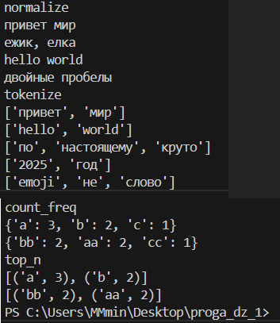

# proga_dz_1 wow
Lab 03
Lab03
```python
def normalize(text: str, *, casefold: bool = True, yo2e: bool = True) -> str:
    if not isinstance(text, str):
        return TypeError
    if casefold:
        text = text.casefold()
    if yo2e:
        while "ё" in text or "Ё" in text:
            text = text.replace("ё", "e", 1).replace("Ё", "Е", 1)
    text = text.replace("\t", " ").replace("\r", " ").replace("/n", " ")
    text = ' '.join(text.split())
    return text

import re
def tokenize(text: str) -> list[str]:
    if not isinstance(text, str):
        return TypeError
    result = []
    result = re.findall(r'\w+(?:-\w+)*', text)
    return result

def count_freq(tokens: list[str]) -> dict[str, int]:
    counts = {}
    if not isinstance(tokens, list):
        return TypeError
    for word in tokens:
        if not isinstance(word, str):
            return TypeError
    for word in tokens:
        counts[word] = counts.get(word, 0) + 1
    return counts


def top_n(freq: dict[str, int], n: int = 5) -> list[tuple[str, int]]:
    result = []
    if not isinstance(freq, dict):
        return TypeError
    for element in freq:
        if not isinstance(element, (str, int)):
            return TypeError
    if not isinstance(n, int) or n <= 0:
        return TypeError
    result = sorted(freq.items(), key=lambda item: item[1], reverse=True)[:n]
    return result
        
    


print("normalize")
print(normalize("ПрИвЕт\nМИр\t"))
print(normalize("ёжик, Ёлка"))
print(normalize("Hello\r\nWorld"))
print(normalize("  двойные   пробелы  "))

print("tokenize")
print(tokenize("привет мир"))
print(tokenize("hello,world!!!"))
print(tokenize("по-настоящему круто"))
print(tokenize("2025 год"))
print(tokenize("emoji 😀 не слово"))

print("count_freq")
print(count_freq(["a","b","a","c","b","a"]))
print(count_freq(["bb","aa","bb","aa","cc"]))

print("top_n")
print(top_n(count_freq(["a","b","a","c","b","a"]), n = 2))
print(top_n(count_freq(["bb","aa","bb","aa","cc"]), n = 2))
```


normalize
tokenize
count_freq
top_n

```python
from sys import stdin
import os
directory = os.getcwd()
module_path = os.path.join(directory, "lib")
from lib.text import normalize, top_n, count_freq
def read():
    text = stdin.read() 
    normalize_text = normalize(text)  
    print(f"всего слов: {len(normalize_text)}")
    print(f"уникальных слов: {len(set(normalize_text))}")
    freq = count_freq(list(normalize_text))
    print(f"топ-5: {top_n(freq, 5)}")
if __name__ == "__main__":
    read()

# запускается только с команды "echo "Привет, мир! Привет!!!" | py src/lab03/text_stats.py" без $ и с py вместо python
# не видит модули несмотря на __init__.py и module_path
```
Lab 02

Задание А
```python
nums_minmax = [1.5, 2, 2.0, -3.1]  #сюда тест кейс 
def min_max(nums_minmax: list[float | int]) -> tuple[float | int, float | int]:
    if not nums_minmax:
        return ValueError
    if nums_minmax:
        small_num = nums_minmax[0]
        big_num = nums_minmax[0]
        for i in nums_minmax:
            if i < small_num:
                small_num = i
            if i > big_num:
                big_num = i
    return small_num, big_num
print("min_max", nums_minmax, "--->", min_max(nums_minmax))

nums_unique = [1.0, 1, 2.5, 2.5, 0] #cюда тест кейс
def unique_sorted(nums_unique: list[float | int]) -> list[float | int]:
    if not nums_unique:
        return TypeError
    else:
        result = set(nums_unique)
        result = sorted(result)
        return result
print("unique_sorted", nums_unique, "--->", unique_sorted(nums_unique))


mat = [[1, 2], (3, 4, 5)] #cюда тест кейс
def flatten(mat: list[list | tuple]) -> list:
    result = []
    for rows in mat:
        if not isinstance(rows, (list, tuple)):
            return TypeError
        for i in rows:
                 result.append(i)
    return result
print("flatten", mat, "--->", flatten(mat))
```


min_max cравнивает значения и находит наиб. и наим. путем сравнения элементов списка, начиная с первого и обновления соотв. переменных для сравнения с элементом на новое значение когда то или иное число меньше или больше предыдущего

unique_sorted превращает список в set чтобы избавиться от повторяющихся чисел и преобразует его в упорядоченный список с помощью sorted

flatten берет значения из списков и кортежей, находящихся внутри списка и добавляет их поочередно в итоговый список

Задание В
```python
transpose_mat = [[1, 2], (3, 4, 5)] #сюда тест кейс
def transpose(transpose_mat: list[list[float | int]]) -> list[list]:
    result = []
    if not transpose_mat:
        return []
    for i in transpose_mat:
        if len(transpose_mat[0]) != len(i):
            return ValueError
    else:
        result = [list(i) for i in zip(*transpose_mat)]
        return result
print("transpose", transpose_mat, "--->", transpose(transpose_mat))

row_mat = [[1, 2], (3, 4, 5)] #сюда тест кейс
def row_sums(row_mat: list[list[float | int]]) -> list[float]:
    result = []
    for row in row_mat:
        if len(row_mat[0]) != len(row):
            return ValueError
        else:
            result.append(sum(row))
    return result
print("row_sums", row_mat, "--->", row_sums(row_mat))


col_mat = [[1, 2], (3, 4, 5)] #сюда тест кейс
def col_sums(col_mat: list[list[float | int]]) -> list[float]:
    result = []
    for row in row_mat:
        if len(row_mat[0]) != len(row):
                return ValueError
        else:
            result = [sum(col) for col in zip(*col_mat)]
    return result
print("col_sums", col_mat, "--->", col_sums(col_mat))
```


transpose использует метод zip, который распаковывает матрицу по строкам и объединяет элементы с одинаковыми индексами из разных изначальных строк матрицы, что значит что при выводе этих строк мы получим матрицу, у которой столбцы и строки поменялись местами

row_sums считает сумму элементов каждого элемента списка содержащего списки которые являются строками матрицы

col_sums использует метод zip, который распаковывает матрицу по строкам и объединяет элементы с одинаковыми индексами из разных изначальных строк матрицы, благодаря чему получаются строкиб состоящие из столбцов матрицы. потом столбцы суммируются 

Задание С
```python
def format_record(rec: tuple[str, str, float]) -> str:
    if not isinstance(rec, tuple):
         return TypeError
    if not isinstance(rec[0], str):
         return TypeError
    if not isinstance(rec[1], str):
         return TypeError
    fio = rec[0].strip().split()
    group = rec[1].strip()
    gpa = rec[2]
    if not isinstance(gpa, float):
        return TypeError, "неправильно введен gpa"
    if not group:
        return ValueError, "неправильно введена группа"
    if len(fio) < 2:
        return ValueError, "неправильно введено фио"  
    if len(fio) == 2:
            fio_altered = f"{fio[0].capitalize()}, {fio[1][0].capitalize()}."
    if len(fio) == 3:
            fio_altered = f"{fio[0].capitalize()} {fio[1][0].capitalize()}.{fio[2][0].capitalize()}."
    result = f"{fio_altered}, гр.{group}, {gpa:.2f}"  
    return result

print(format_record(("Иванов Иван Иванович", "BIVT-25", 4.6)))
print(format_record(("Петров Пётр", "IKBO-12", 5.0)))
print(format_record(("Петров Пётр Петрович", "IKBO-12", 5.0)))
print(format_record(("  сидорова  анна   сергеевна ", "ABB-01", 3.999)))
  
```


функция проверяет значения внутри кортежа на правильность ввода данных(наличие группы, длину фио и тип ввода gpa) и выводит для определенной длины фио с помощью метода capitalize фамилию и инициалы с заглавной буквы,:.2f определяет формат вывода float как всегда имеющий только 2 знака после запятой

Lab01

Задание 1  
```python
name = input()
age = input()

print(f"имя: {name}")
print(f"привет {name}! через год тебе будет {int(age)+1}")
```


Задание 2 
```python
a = input()
b = input()

if "," in a:
    a = a.replace(",", ".", 1)
if "," in b:
    b = b.replace(",", ".", 1)

sum = float(a) + float(b)
avg = float((float(a) + float(b))/2)

print(f"sum:{sum:.2f}; avg:{avg:.2f}")
``` 


Задание 3 
```python
price = float(input("цена, $ "))
discount = float(input("скидка, % "))
vat = float(input("ндс, % "))

base = price * (1 - discount / 100)
vat_amount = base * (vat / 100)
total = base + vat_amount

print(f"база после скидки {base:.2f} $")
print(f"ндс {(vat_amount):.2f} $")
print(f"итого к оплате {(total):.2f} $")
```


Задание 4
```python
m = int(input())
hours = m // 60
minutes = m % 60

print(f"{hours}:{minutes}")
```


Задание 5  
```python
fio = input().strip().split()

result = str(fio[0][0]+fio[1][0]+fio[2][0])
print(result.upper())

fio_2 = " ".join(fio)
count = 0
for i in fio_2:
    count += 1
print(count)
```


