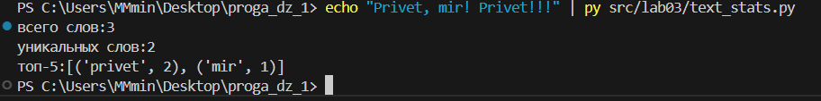

# Lab07
[README](src\lab07\README.md)

# Lab06
## Text
```python
import argparse 
from helpersforproperimport.helpers import top_n, normalize, tokenize, count_freq
from pathlib import Path

def cat_stats():
    parser = argparse.ArgumentParser(description="CLI‑утилиты лабораторной №6 для работы с текстом")
    subparsers = parser.add_subparsers(dest="command")

        # подкоманда cat
    cat_parser = subparsers.add_parser("cat", help="Вывести содержимое файла")
    cat_parser.add_argument("--input", required=True, help="путь к файлу с текстом")
    cat_parser.add_argument("-n", action="store_true", help="нумеровать строки")

        # подкоманда stats
    stats_parser = subparsers.add_parser("stats", help="Частоты слов")
    stats_parser.add_argument("--input", required=True, help="путь к файлу с текстом")
    stats_parser.add_argument("--top", type=int, default=5, help="количество выводимых слов")

    stat_args = parser.parse_args()
    input_path = Path(stat_args.input)
    if not input_path.exists():
        parser.error("файл не найден")

    if stat_args.command == "cat":
        """ Реализация команды cat """
        try:
            lines = 0
            with open(stat_args.input , "r", encoding = "utf8") as r:   
                for line in r:
                    lines += 1
                    print(lines, line.rstrip())
        except:
            parser.error
            "ошибка чтения файла"
           

    if stat_args.command == "stats":

            """ Реализация команды stats """
    try:
        with open(stat_args.input, 'r', encoding='utf-8') as f:
            text = f.read()
            normalized_text = normalize(text)
            if len(normalized_text.strip()) == 0:
                return ValueError
            tokens = tokenize(normalized_text)
            freq = count_freq(tokens)
            top_words = top_n(freq, stat_args.top)
            print(top_words)
    except:
         parser.error
         "ошибка чтения файла"

if __name__ == "__main__":
    cat_stats()
```
### Тест кейсы


## Convert
```python
import argparse 
from helpersforproperimport.helpers import json_to_csv, csv_to_json, csv_to_xlsx

def convert():
    parser = argparse.ArgumentParser(description="Конвертеры данных")
    sub = parser.add_subparsers(dest="cmd")

    json_csv_parser = sub.add_parser("json2csv")
    json_csv_parser.add_argument("--in", dest="input", required=True, help="путь к файлу ввода")
    json_csv_parser.add_argument("--out", dest="output", required=True, help="путь в файлу куда будет записан результат")

    csv_json_parser = sub.add_parser("csv2json")
    csv_json_parser.add_argument("--in", dest="input", required=True, help="путь к файлу ввода")
    csv_json_parser.add_argument("--out", dest="output", required=True, help="путь в файлу куда будет записан результат")

    csv_xlsx_parser = sub.add_parser("csv2xlsx")
    csv_xlsx_parser.add_argument("--in", dest="input", required=True, help="путь к файлу ввода")
    csv_xlsx_parser.add_argument("--out", dest="output", required=True, help="путь в файлу куда будет записан результат")

    conv_args = parser.parse_args()

    """
        Вызываем код в зависимости от аргументов.
    """
    if conv_args.cmd is None:
        parser.print_help()

    if conv_args.cmd == "json2csv":
        json_to_csv(conv_args.input, conv_args.output)

    elif conv_args.cmd == "csv2json":
        csv_to_json(conv_args.input, conv_args.output)

    elif conv_args.cmd == "csv2xlsx":
        csv_to_xlsx(conv_args.input, conv_args.output)
    else:
        parser.print_help()

if __name__ == "__main__":
    convert()
```
### Тест кейсы


# Lab 05
## Задание А
### 
```python
import json, csv
from pathlib import Path

def json_to_csv(json_path: str, csv_path: str) -> None:
    input_json = Path(json_path)
    output_csv = Path(csv_path)

    if not input_json.exists():
        raise FileNotFoundError ("файла нет")
    
    if input_json.is_absolute():
        raise ValueError ("путь не относительный")
    if output_csv.is_absolute():
        raise ValueError ("путь не относительный")
    
    if input_json.suffix.lower() != '.json':
        raise ValueError ("неверный тип input файла")
    if output_csv.suffix.lower() != '.csv':
        raise ValueError ("неверный тип output файла")
    
    try:
        with open(input_json, "r", encoding = "utf8") as r:
            text = json.load(r) #читает файл 
            if not text:
                raise ValueError ("файл пустой")
            if not isinstance(text, list):
                raise ValueError("в файле не список")
            for values in text:
                if not isinstance(values, dict):
                    raise ValueError("в файле не cписок словарей")
            headers = set() 
            for item in text:
                headers.update(item.keys()) #собирает все уникальные заголовки в список
    except json.JSONDecodeError:
        "json decode error"

    with open(output_csv, "w", encoding = "utf8") as w:
        w = csv.DictWriter(w, fieldnames=headers) #записывает словари в csv файл и определяет что будет заголовками столбцов
        w.writeheader() #записывает заголовки таблицы
        w.writerows(text) #записывает значения из словарей


def csv_to_json(csv_path: str, json_path: str) -> None:
    input_csv = Path(csv_path)
    output_json = Path(json_path)

    if not input_csv.exists():
        raise FileNotFoundError ("файла нет")
    
    if input_csv.is_absolute():
        raise ValueError ("путь не относительный")
    if output_json.is_absolute():
        raise ValueError ("путь не относительный")
    
    if input_csv.suffix.lower() != '.csv':
        raise ValueError ("неверный тип input файла")
    if output_json.suffix.lower() != '.json':
        raise ValueError ("неверный тип output файла")
    
    with open(input_csv, "r", encoding = "utf8") as r:
        read = csv.DictReader(r) #читает файл
        if read.fieldnames is None:
            raise ValueError ("нет заголовков")
        row1 = next(read, None) #читает строку после заголовков, если он пустой возвращает none
        if row1 is None:
            raise ValueError("файл пустой")
        readfordump = [row1] + list(read) #тк мы уже читали первую строку для проверки мз-за чего ее нужно добавить к оставшимся которые питон еще не прочитал


       
    with open(output_json, "w", encoding = "utf8") as w:
        json.dump(readfordump, w, ensure_ascii=False, indent = 2) #записывает файл 
```
Примеры успешной конвертации
json to csv


csv to json


## Задание В
###
```python
import csv
from pathlib import Path
from openpyxl import Workbook

def csv_to_xlsx(csv_path: str, xlsx_path: str) -> None:
    input_csv = Path(csv_path)
    output_xlsx = Path(xlsx_path)
    if not input_csv.exists():
        raise FileNotFoundError 

    if input_csv.is_absolute():
        raise ValueError
    if output_xlsx.is_absolute():
        raise ValueError
    
    if input_csv.suffix.lower() != '.csv':
        raise ValueError 
    if output_xlsx.suffix.lower() != '.xlsx':
        raise ValueError 
    
    with open(input_csv, "r", encoding = "utf8") as r:
        read = csv.DictReader(r)
        if not read.fieldnames:
            raise ValueError ("нет заголовков")
        rows = list(read)
        if not rows:
           return ValueError
            
    w = Workbook() #создает объект для записи в xlsx файл
    sheet1 = w.active #получает страницу таблицы в которую будут записываться данные
    sheet1.title = "sheet 1" #можно поменять название
    sheet1.append(read.fieldnames) #добавляет заголовки столбцов

    for row in rows:
        sheet1.append(list(row.values())) #берет значения из строк и добавляет в таблицу

    for column in sheet1.columns:
        max_length = 0
        column_letter = column[0].column_letter #

        for cell in column:
            if cell.value is not None: #
                max_length = max(max_length, len(str(cell.value))) #находит максимальную длину значения в столбце
                sheet1.column_dimensions[column_letter].width = max(max_length + 2, 8) #ставит ширину столбца как не превышающую 8, но добавляет 2 символа
    w.save(output_xlsx) #сохраняет файл
```
Пример успешной конвертации


# Lab 04
## Задание A
### Мини-тесты
Пример чтения


Пример записи
```python
write_csv([("word","count"),("test",3)], "data/check.csv")
```


### Краевые случаи

пустой файл --> пустая строка


файл читается полностью по тз
```python
text = r.read() 
```
лучше так не делать, так как при слишком большом объеме файла на обработку будет сразу уходить много ресурсов


write csv пустой --> пустой файл
write csv header = ("a","b") ---> только заголовок в файле


## Задание B
input txt не существует --> объяснение ошибки

```python
except FileNotFoundError:
            print("файла нет") 
            sys.exit(1)      
```

пустой вход --> файл только с words, count


чтобы поменять кодировку, в команде необходимо это прописать

например

```python
py src/lab04/text_report.py --in data/input.txt --encoding cp1251 

поменять на 

py src/lab04/text_report.py --in data/input.txt --encoding utf8
```
(из-за виндовс используется py а не python)

получим


# Lab03
```python
import re
def normalize(text: str, *, casefold: bool = True, yo2e: bool = True, no_punctation: bool = True) -> str:
    if not isinstance(text, str):
        return TypeError
    if casefold:
        text = text.casefold()
    if yo2e:
        while "ё" in text or "Ё" in text:
            text = text.replace("ё", "e", 1).replace("Ё", "Е", 1)
    text = text.replace("\t", " ").replace("\r", " ")
    text = ' '.join(text.split())
    if no_punctation:
        text = re.sub(r'[^\w\s]', '', text)
    return text

import re
def tokenize(text: str) -> list[str]:
    if not isinstance(text, str):
        return TypeError
    result = []
    result = re.findall(r'\w+(?:-\w+)*', text)
    return result

def count_freq(tokens: list[str]) -> dict[str, int]:
    counts = {}
    if not isinstance(tokens, list):
        return TypeError
    for word in tokens:
        if not isinstance(word, str):
            return TypeError
    for word in tokens:
        counts[word] = counts.get(word, 0) + 1
    return counts

def top_n(freq: dict[str, int], n: int = 5) -> list[tuple[str, int]]:
    result = []
    if not isinstance(freq, dict):
        return TypeError
    for element in freq:
        if not isinstance(element, (str, int)):
            return TypeError
    if not isinstance(n, int) or n <= 0:
        return TypeError
    result = sorted(freq.items(), key=lambda item: item[1], reverse=True)[:n]
    return result
```

В normalize для корректного вывода в пункте B был добавлен параметр no_punctuation, с помощью re.findall(r'\w+(?:-\w+)*', text) 
где r'\w+(?:-\w+)* убирает все знаки препинания, кроме тире. Используется casefold вместо lower т.к. casefold больше подходит для UTF-8 из-за того, что он учитывает специальные символы

В tokenize функция находит все слова и добавляет их в список 

В count_freq функция берет токены из словаря и при их обнаружении они добавляются в словарь. +1 увеличивает значение, а если слова еще нет в словаре добавляет со значением 1

В top_n [:n] cрезает результат по значению n, в key = lambda item: item 1 item принимает параметр для сортировки по второму элементу, чтобы список сортировался по частоте, а lambda - ключ сортировки, который используется для работы со сложными структурами данных, тк она создает  однострочную функцию без использования def 

## Задание В
### ВАЖНО: Команда "echo "Privet, mir! Privet!!!" | py src/lab03/text_stats.py" т.к. Powershell не читает UTF-8, py вместо python из-за виндовс
```python
from sys import stdin, path
import os
file_path = os.path.dirname(os.path.abspath(__file__))
lib_path = os.path.join(file_path, "..\\lib\\text")
path.append(lib_path)
from text import normalize, tokenize, count_freq, top_n

def read():
    text = stdin.read() 
    normal_text = normalize(text) 
    token_text = tokenize(text)
    print(f"всего слов:{len(token_text)}")
    print(f"уникальных слов:{len(set((tokenize(normal_text))))}")
    freq = count_freq(tokenize(normal_text))
    print(f"топ-5:{top_n(freq, 5)}")
if __name__ == "__main__":
    read()
```


Импортирование функций из другого файла происходит путем задания дороги к модулю lib, в котором находится папка с файлом с функциями. Т.к. Powershell не работает с UTF-8, строка в функции записана транскрипцией на английский, иначе символы не считываются и выдаются как ?. file_path определяет путь к исполняемому файлу из директория, а lib_path определяет путь к файлу с библиотеками. stdin.read() читает ввод целиком до получения сигнала eof и возвращает все одной строкой

# Lab 02

## Задание А
```python
nums_minmax = [1.5, 2, 2.0, -3.1]  #сюда тест кейс 
def min_max(nums_minmax: list[float | int]) -> tuple[float | int, float | int]:
    if not nums_minmax:
        return ValueError
    if nums_minmax:
        small_num = nums_minmax[0]
        big_num = nums_minmax[0]
        for i in nums_minmax:
            if i < small_num:
                small_num = i
            if i > big_num:
                big_num = i
    return small_num, big_num
print("min_max", nums_minmax, "--->", min_max(nums_minmax))

nums_unique = [1.0, 1, 2.5, 2.5, 0] #cюда тест кейс
def unique_sorted(nums_unique: list[float | int]) -> list[float | int]:
    if not nums_unique:
        return TypeError
    else:
        result = set(nums_unique)
        result = sorted(result)
        return result
print("unique_sorted", nums_unique, "--->", unique_sorted(nums_unique))


mat = [[1, 2], (3, 4, 5)] #cюда тест кейс
def flatten(mat: list[list | tuple]) -> list:
    result = []
    for rows in mat:
        if not isinstance(rows, (list, tuple)):
            return TypeError
        for i in rows:
                 result.append(i)
    return result
print("flatten", mat, "--->", flatten(mat))
```


min_max cравнивает значения и находит наиб. и наим. путем сравнения элементов списка, начиная с первого и обновления соотв. переменных для сравнения с элементом на новое значение когда то или иное число меньше или больше предыдущего

unique_sorted превращает список в set чтобы избавиться от повторяющихся чисел и преобразует его в упорядоченный список с помощью sorted

flatten берет значения из списков и кортежей, находящихся внутри списка и добавляет их поочередно в итоговый список

## Задание В
```python
transpose_mat = [[1, 2], (3, 4, 5)] #сюда тест кейс
def transpose(transpose_mat: list[list[float | int]]) -> list[list]:
    result = []
    if not transpose_mat:
        return []
    for i in transpose_mat:
        if len(transpose_mat[0]) != len(i):
            return ValueError
    else:
        result = [list(i) for i in zip(*transpose_mat)]
        return result
print("transpose", transpose_mat, "--->", transpose(transpose_mat))

row_mat = [[1, 2], (3, 4, 5)] #сюда тест кейс
def row_sums(row_mat: list[list[float | int]]) -> list[float]:
    result = []
    for row in row_mat:
        if len(row_mat[0]) != len(row):
            return ValueError
        else:
            result.append(sum(row))
    return result
print("row_sums", row_mat, "--->", row_sums(row_mat))


col_mat = [[1, 2], (3, 4, 5)] #сюда тест кейс
def col_sums(col_mat: list[list[float | int]]) -> list[float]:
    result = []
    for row in row_mat:
        if len(row_mat[0]) != len(row):
                return ValueError
        else:
            result = [sum(col) for col in zip(*col_mat)]
    return result
print("col_sums", col_mat, "--->", col_sums(col_mat))
```


transpose использует метод zip, который распаковывает матрицу по строкам и объединяет элементы с одинаковыми индексами из разных изначальных строк матрицы, что значит что при выводе этих строк мы получим матрицу, у которой столбцы и строки поменялись местами

row_sums считает сумму элементов каждого элемента списка содержащего списки которые являются строками матрицы

col_sums использует метод zip, который распаковывает матрицу по строкам и объединяет элементы с одинаковыми индексами из разных изначальных строк матрицы, благодаря чему получаются строкиб состоящие из столбцов матрицы. потом столбцы суммируются 

Задание С
```python
def format_record(rec: tuple[str, str, float]) -> str:
    if not isinstance(rec, tuple):
         return TypeError
    if not isinstance(rec[0], str):
         return TypeError
    if not isinstance(rec[1], str):
         return TypeError
    fio = rec[0].strip().split()
    group = rec[1].strip()
    gpa = rec[2]
    if not isinstance(gpa, float):
        return TypeError, "неправильно введен gpa"
    if not group:
        return ValueError, "неправильно введена группа"
    if len(fio) < 2:
        return ValueError, "неправильно введено фио"  
    if len(fio) == 2:
            fio_altered = f"{fio[0].capitalize()}, {fio[1][0].capitalize()}."
    if len(fio) == 3:
            fio_altered = f"{fio[0].capitalize()} {fio[1][0].capitalize()}.{fio[2][0].capitalize()}."
    result = f"{fio_altered}, гр.{group}, {gpa:.2f}"  
    return result

print(format_record(("Иванов Иван Иванович", "BIVT-25", 4.6)))
print(format_record(("Петров Пётр", "IKBO-12", 5.0)))
print(format_record(("Петров Пётр Петрович", "IKBO-12", 5.0)))
print(format_record(("  сидорова  анна   сергеевна ", "ABB-01", 3.999)))
  
```


функция проверяет значения внутри кортежа на правильность ввода данных(наличие группы, длину фио и тип ввода gpa) и выводит для определенной длины фио с помощью метода capitalize фамилию и инициалы с заглавной буквы,:.2f определяет формат вывода float как всегда имеющий только 2 знака после запятой

Lab01

Задание 1  
```python
name = input()
age = input()

print(f"имя: {name}")
print(f"привет {name}! через год тебе будет {int(age)+1}")
```


Задание 2 
```python
a = input()
b = input()

if "," in a:
    a = a.replace(",", ".", 1)
if "," in b:
    b = b.replace(",", ".", 1)

sum = float(a) + float(b)
avg = float((float(a) + float(b))/2)

print(f"sum:{sum:.2f}; avg:{avg:.2f}")
``` 


Задание 3 
```python
price = float(input("цена, $ "))
discount = float(input("скидка, % "))
vat = float(input("ндс, % "))

base = price * (1 - discount / 100)
vat_amount = base * (vat / 100)
total = base + vat_amount

print(f"база после скидки {base:.2f} $")
print(f"ндс {(vat_amount):.2f} $")
print(f"итого к оплате {(total):.2f} $")
```


Задание 4
```python
m = int(input())
hours = m // 60
minutes = m % 60

print(f"{hours}:{minutes}")
```


Задание 5  
```python
fio = input().strip().split()

result = str(fio[0][0]+fio[1][0]+fio[2][0])
print(result.upper())

fio_2 = " ".join(fio)
count = 0
for i in fio_2:
    count += 1
print(count)
```


